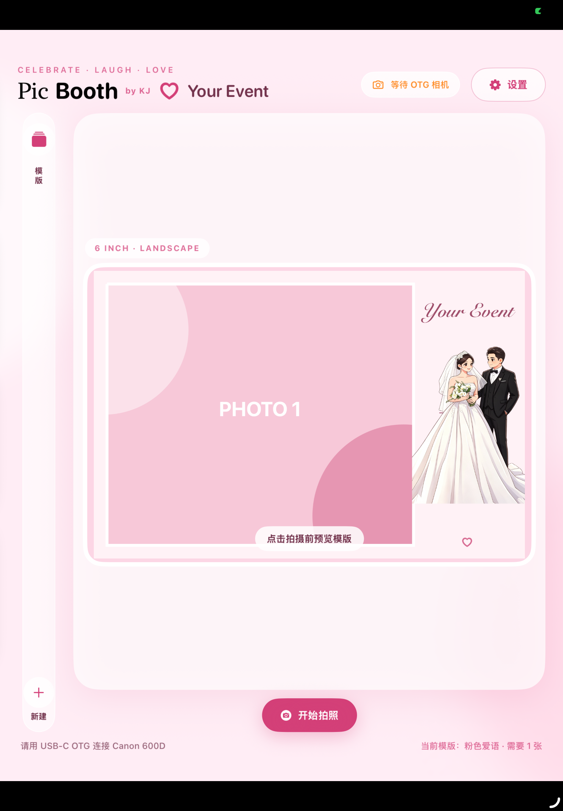

# PicBooth by KJ


PicBooth 是一套本地运行的 Photo Booth，适合婚礼、生日会、毕业典礼、公司活动、节庆聚会及其他 event。无需云端服务或付费会员，照片、模板和活动资料都保存在自己的设备上。

本仓库同时包含：

- Mac 版：在浏览器中运行的完整 Photo Booth，通过 Node.js 控制相机、合成照片并打印。
- iPad 版：原生 SwiftUI App，通过 USB-C OTG 连接 Canon EOS 相机，并支持 AirPrint。

## 功能

- 外接相机实时预览、倒数拍摄和多张连拍。
- Mac 未检测到外接相机时可自动使用 Webcam。
- Canon EOS 600D USB/PTP 拍摄与 Live View。
- 6 寸横版及竖版照片模板。
- 可视化模板设计器，可编辑照片框、文字、字体、颜色、爱心和图片图层。
- 支持导入 PNG/JPEG 装饰素材。
- 自动套用活动名称、日期和自定义文字。
- 下载文件按 `picbooth_0001.jpg`、`picbooth_0002.jpg` 依次编号。
- 保存、系统分享、AirDrop 与打印。
- Mac 支持 Canon SELPHY CP1300；iPad 使用 AirPrint。

## 项目结构

```text
.
├── public/                 # Mac 版网页界面
├── server.js              # Mac 本地服务器、相机和打印控制
├── scripts/               # 成片合成脚本
├── data/                  # 活动、模板和本地照片资料
├── iPadPicBooth/          # PicBooth iPad 原生工程
├── 启动PicBooth.command    # Mac 一键启动
└── 演示模式.command        # 无相机演示
```

## Mac 版

### 环境

- macOS
- Node.js 18 或以上
- Python 3
- 使用外接相机时需安装 `gphoto2`

```sh
brew install gphoto2
```

### 启动

在项目目录运行：

```sh
npm start
```

然后打开：

```text
http://localhost:8787
```

也可以双击 `启动PicBooth.command`。

无相机测试：

```sh
BOOTH_DEMO=1 npm start
```

或双击 `演示模式.command`。

### 相机与打印机

1. 用可传输数据的 USB 线连接相机。
2. Canon EOS 建议使用 `M` 或 `P` 模式、JPEG 画质，并关闭自动关机。
3. 为减少连续拍摄延迟，可将镜头切换至 MF。
4. 在“系统设置 → 打印机与扫描仪”中添加打印机。
5. 使用 CP1300 时，让 Mac 与打印机连接同一个 Wi‑Fi，或使用打印机的直接连接模式。

## iPad 版

原生工程位于 [iPadPicBooth](iPadPicBooth/README.md)。

当前版本支持：

- iPad Air 4 或其他 USB-C iPad。
- USB-C OTG 连接 Canon EOS 600D。
- Canon EOS 专用 PTP 遥控拍摄。
- 实时取景、倒数、多张拍摄及模板合成。
- 创建并保存多套模板。
- 导入 PNG/JPEG 图片图层。
- 保存到照片、AirDrop、系统分享和 AirPrint。

## 模板

Mac 与 iPad 使用相同的模板数据结构：

- 横版：`1800 × 1200 px`
- 竖版：`1200 × 1800 px`
- `{event}`：活动名称
- `{date}`：活动日期
- `{text}`：活动文字

模板支持照片、文字、爱心和图片图层。Mac 版模板位于 `data/templates.json`；当前模板及其图片资源也已打包到 iPad 工程。

## 本地与隐私

- 不需要域名或互联网。
- Mac 版运行在本机 `localhost:8787`。
- iPad 版直接在设备上处理照片。
- 活动照片不会自动上传到第三方服务器。